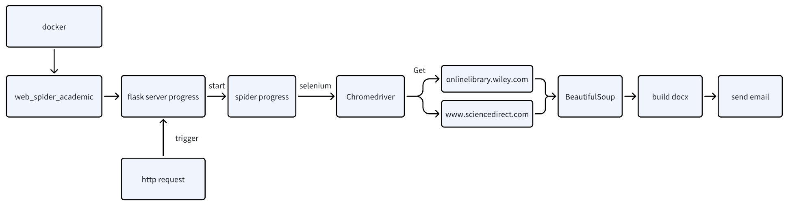

# 简介

基于selenium实现的爬虫系统，可以爬取wiley和sciencedirect上的文献信息，自动翻译后汇总成word文档发送到邮箱。本仓库提供了配置好环境的docker镜像，任何人都可以修改源码然后轻松部署。

通过本仓库，你可以参考：

- 基于selenium实现爬虫
- 基于baidu api实现实时翻译
- 基于docx生成word文档
- 基于smtplib自动发送邮件

# 如何使用

## 基于docker部署（推荐）

```
# 通过百度网盘下载镜像tar文件
https://pan.baidu.com/s/1OQJEcDK2rY2P3-vKQMAGOg?pwd=e95v

# 通过scp将tar文件拷贝到服务器上，这里假设拷贝到用户根目录
scp spider.tar root@server_ip:~/

# ssh登录服务器
ssh root@server_ip
cd ~

# 假设服务器已经安装了docker，从tar文件加载镜像
docker load -i spider.tar

# 假设服务器已经安装了git
git clone https://github.com/howard1209a/web_spider_academic.git

# 填入自己的配置，具体配置含义请查看下文
vim ~/web_spider_academic/config.json

# 执行Dockerfile生成web_spider_academic镜像
cd ~/web_spider_academic
docker build -t web_spider_academic .

# 启动容器
docker run -d -p 5000:5000 web_spider_academic

# 接下来就可以使用了，在可访问服务器的网络下请求如下链接，之后在邮箱可以收到自给定文献名以来的全部最新文献
http://服务器ip:5000/spider?wiley_paper=文献名&sciencedirect_paper1=文献名&sciencedirect_paper2=文献名&sciencedirect_volume1=最新卷号&sciencedirect_volume2=最新卷号
```

## 镜像构建过程（繁琐）

下面提供spider.tar镜像的详细构建过程

### 安装docker

```
# 安装docker依赖
sudo apt install apt-transport-https ca-certificates curl software-properties-common

# 添加 Docker 官方的 GPG 密钥
curl -fsSL https://download.docker.com/linux/debian/gpg | sudo tee /etc/apt/trusted.gpg.d/docker.asc

# 添加 Docker APT 仓库
echo "deb [arch=amd64] https://download.docker.com/linux/debian $(lsb_release -cs) stable" | sudo tee /etc/apt/sources.list.d/docker.list > /dev/null
sudo apt update

# 安装 Docker CE（社区版）
sudo apt install docker-ce docker-ce-cli containerd.io

# 启动docker服务并设置开机自启
sudo systemctl start docker
sudo systemctl enable docker

# 检查 Docker 服务的状态
sudo systemctl status docker
```

#### docker常见命令

```
# 查看本地镜像
docker images

# 拉取镜像（从 Docker Hub 拉取镜像）
docker pull <image_name>

# 删除镜像
docker rmi <image_name>

# 从 Dockerfile 构建镜像
docker build -t <image_name>:<tag> <path_to_dockerfile>

# 查看镜像详细信息
docker inspect <image_name>

# 运行容器并进入交互模式
docker run -it <image_name> bash

# 运行容器并在后台运行
docker run -d <image_name>

# 查看正在运行的容器
docker ps

# 查看所有容器（包括已停止的）
docker ps -a

# 停止容器
docker stop <container_id>

# 启动已停止的容器
docker start <container_id>

# 删除容器
docker rm <container_id>

# 进入容器的命令行
docker exec -it <container_id> /bin/bash

# 查看容器日志
docker logs <container_id>

# 从容器打包镜像
docker commit <container_id_or_name> <new_image_name>:latest

# 保存镜像tar文件
docker save -o /path/to/save/my_image.tar my_image:latest

# 端口映射
docker run -d -p 5000:5000 --name my_container_name my_image_name
```

### 安装clash

配置clash代理，参考 https://github.com/Elegycloud/clash-for-linux-backup

```
# 验证代理可访问外网
curl -I https://www.youtube.com
```

### 配置docker的clash代理

```
vim /etc/systemd/system/docker.service.d/http-proxy.conf
# 内容如下
[Service]
Environment="HTTP_PROXY=http://localhost:7890"
Environment="HTTPS_PROXY=http://localhost:7890"
Environment="NO_PROXY=localhost,127.0.0.1"

vim /etc/docker/daemon.json
# 内容如下
{
  "http-proxy": "http://127.0.0.1:7890",
  "https-proxy": "http://127.0.0.1:7890",
  "no-proxy": "localhost,127.0.0.1",
  "registry-mirrors": ["https://registry-1.docker.io"]
}

# 重新加载 systemd 配置并重启 Docker
sudo systemctl daemon-reload
sudo systemctl restart docker

# 现在可以通过docker hub拉取selenium/standalone-chrome镜像
docker pull selenium/standalone-chrome
```

### 基于selenium/standalone-chrome构建spider镜像

```
# 安装虚拟环境
apt-get update
apt-get install python3-venv

# 创建虚拟环境
cd /
python3 -m venv myenv

# 激活虚拟环境
source myenv/bin/activate

# 在虚拟环境中安装依赖库
pip install selenium beautifulsoup4 python-docx flask requests

# 查看Chrome版本
google-chrome --version

# 下载适合容器内Chrome版本的chromedriver
curl -O https://storage.googleapis.com/chrome-for-testing-public/131.0.6778.204/linux64/chromedriver-linux64.zip
unzip chromedriver-linux64.zip
mv chromedriver-linux64 /usr/local/bin/

# 导入宋体字体文件
https://pan.baidu.com/s/1aIDNnMjlPVOOv93dijZ6mg?pwd=m5a4
scp simsun.zip root@server_ip:~/
mkdir /usr/share/fonts/truetype/SimSun
cp ~/simsun.ttf /usr/share/fonts/truetype/SimSun/simsun.ttf
cd /usr/share/fonts/truetype/SimSun
sudo mkfontscale
sudo mkfontdir
sudo fc-cache -fv

# 列出所有字体，此时应该已经存在宋体
fc-list
```

# 配置文件

config.json配置文件

- sender_email：邮件发送者邮箱
- receiver_email：邮件接收者邮箱
- email_authorization_code：邮件发送者邮箱的校验码，具体获取方式请自行百度
- baidu_translate_api_appid：百度翻译api的appid，具体获取方式请自行百度
- baidu_translate_api_appkey：百度翻译api的appkey，具体获取方式请自行百度

# 系统设计

系统选型，小型爬虫一般用python开发，原因如下：
- python语法简单更偏应用层，脚本语言跨平台且迭代效率快
- 小型爬虫对CPU和内存的占用低，不需要资源高效型系统设计
- python有丰富的爬虫库和数据处理库，联系紧密的两者可以高效开发


